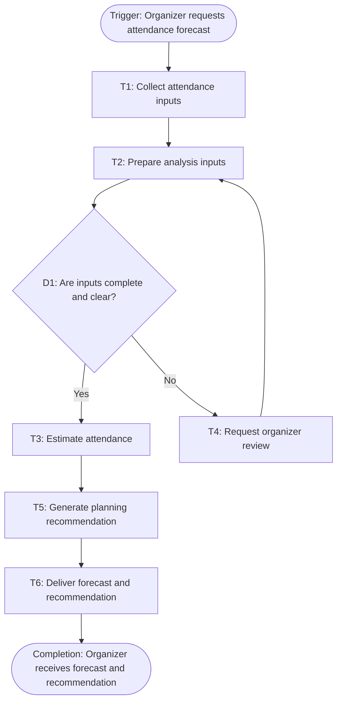

# Workflow of Tasks

## 1. Workflow Overview
### 1.1 Workflow Goal
This workflow supports the system goal defined in `my_first_agent/README.md`.

### 1.2 Workflow Trigger

The workflow begins when a CPVC organizer requests an attendance forecast for an upcoming hackathon using the current registration information and any available optional check-ins.

### 1.3 Completion Condition at Runtime

The workflow is complete when HackTrack delivers an attendance forecast and planning recommendation to the CPVC organizer for review.

### 1.4 General Workflow

HackTrack collects the current registration information and any available optional check-in information. It prepares the information for analysis, uses the previous event’s attendance rate as a starting point, and estimates how many registered students are likely to attend. The system then generates a planning recommendation to help CPVC organizers prepare appropriate amounts of food, drinks, and swag.

If the available information is incomplete or unclear, the system flags the issue for a CPVC organizer to review before completing the forecast. The organizer can review the forecast and recommendation before using them for event planning.

### 1.5 Workflow Diagram

